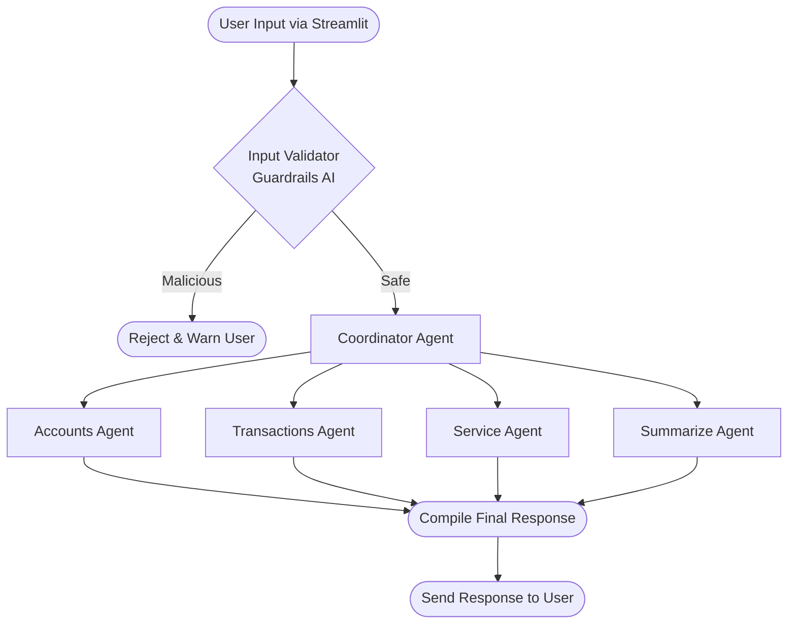
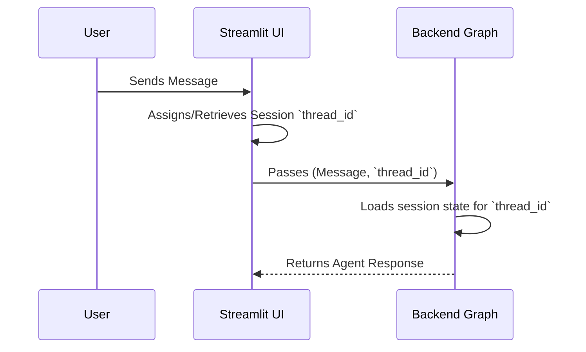
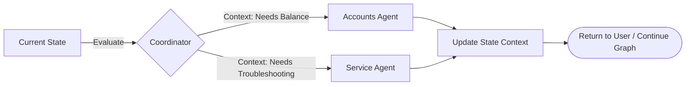
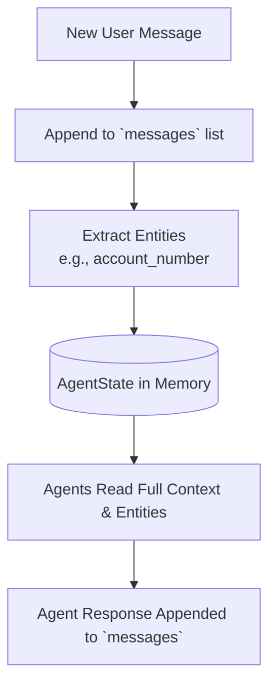

# Multi-Agent Chatbot System

## 📖 1. Project Description
This project is an advanced **Multi-Agent Chatbot** designed to handle complex user queries by dynamically routing them to specialized AI agents. Built with a robust backend, it intelligently orchestrates tasks such as checking account balances, processing transactions, and answering customer service inquiries.

To ensure safety and reliability, the system uses **Guardrails AI** to validate user inputs (preventing prompt injection) and leverages **DeepEval** for rigorous, automated LLM evaluation. The user interacts with the system through a clean and responsive **Streamlit** frontend.

---

## 🔄 2. Workflow Diagram (Flow Chart)

```text
[ User Input via Streamlit ] 
        │
        ▼
[ Input Validator (Guardrails AI) ] ── (If malicious) ─> [ Reject Request ]
        │
        ▼ (If safe)
[ Coordinator Agent ] 
        │
        ├─▶ [ Accounts Agent ]    (Balance, Statements)
        │
        ├─▶ [ Transactions Agent ] (Send Money, Payments)
        │
        ├─▶ [ Service Agent ]      (Troubleshooting, Support)
        │
        └─▶ [ Summarize Agent ]    (Conversation Summaries)
        │
        ▼
[ Final Response to User ]
```

---

## 🧜‍♂️ 3. Workflow as Mermaid Diagram



---

## 🧠 4. Management Flows

The system relies on a central state mechanism (`AgentState`) using LangGraph to effectively handle sessions, context, and memory seamlessly across multiple agent nodes.

### Session Management Flow
Sessions are tied to unique `thread_id`s, ensuring that multiple users or different conversations from the same user remain completely isolated.


### Context Management Flow
The Coordinator Agent maintains context by processing the state (`next_node`, `current_response`, `coordinator_response`) and dynamically deciding the next step based on the evolving conversation.


### Memory Management Flow
Memory is maintained natively using LangGraph's message appending architecture (`add_messages`). 
- **Short-Term Memory**: The `messages` list aggregates all `BaseMessage` objects, providing the agents with the full conversational history of the active thread.
- **State Fields**: Fields like `user_message`, `account_number`, and `user_message_unmasked` store extracted entities for easy retrieval by downstream agents without needing to re-parse history.


---

## ✨ 5. Features Used

- **Multi-Agent Orchestration**: Specialized agents (Accounts, Transactions, Service, Summarize) work collaboratively to solve distinct problems.
- **Dynamic Routing**: A Coordinator Agent that intelligently routes the user's intent to the correct underlying expert agent.
- **Stateful Execution**: Uses LangGraph (`GraphBuilder`) to manage conversational state (`AgentState`), memory, and thread-level session management.
- **Robust Security**: Integration with **Guardrails AI** to protect against prompt injection and malicious inputs.
- **Automated LLM Evaluation**: Integration with **DeepEval** to test the system against metrics like Contextual Relevancy, Faithfulness, Toxicity, Bias, and Hallucination.
- **Interactive UI**: A frontend powered by **Streamlit** for seamless user interaction.

---

## 📝 6. Summary
The Multi-Agent Chatbot is a secure, intelligent, and scalable AI assistant. By breaking down complex tasks into specialized agents and utilizing a robust state graph architecture for context and memory, the system guarantees accurate, contextual, and continuous conversational experiences. 

With built-in safeguards (Guardrails AI) and comprehensive testing frameworks (DeepEval), this project ensures enterprise-grade reliability and safety, offering a robust foundation for modern AI customer service platforms.
